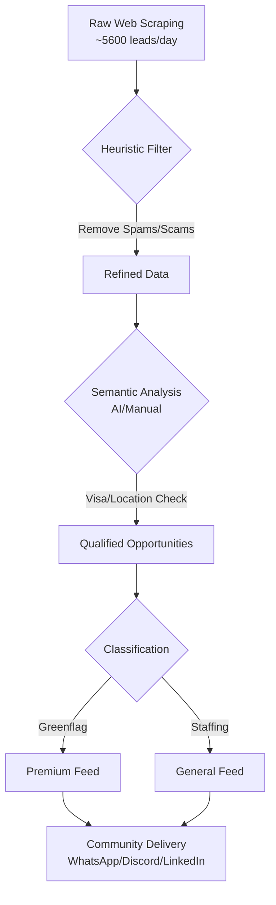

# Bruno Lucusi
## 🏗️ Automation & Integration Systems Builder

I design and build **intelligent automation pipelines** that transform manual, messy workflows into scalable business operations. My expertise lies at the intersection of **Web Scraping, AI Data Filtering, and System Integration**.

> "I don't just write code; I build systems that solve operational bottlenecks."

---

### 🚀 What I do for businesses:
* **Workflow Engineering:** Connecting fragmented tools (APIs, CRMs, Sheets) into unified, automated ecosystems.
* **Intelligent Data Pipelines:** High-volume web scraping (5k+ records/day) with AI-powered classification and filtering.
* **Process Optimization:** Converting "human-in-the-loop" tasks into autonomous or semi-autonomous workflows.
* **Information Filtering Engines:** Building custom taxonomies to eliminate noise and extract high-value insights from raw data.

---

### 🛠️ Tech Stack & Ecosystem

  

**Specialized in:** `Python (Scraping/Data)` • `n8n (Workflows)` • `API Integrations` • `AI/LLM Implementation` • `Data Normalization`

---

### 📂 Featured Automation Projects

#### 🤖 [Job Intelligence & Lead Pipeline](https://github.com/tstryder)
A complete system designed to scrape, filter, and classify thousands of international job leads daily.
* **The Problem:** 5,000+ raw leads daily with 90% noise (visa requirements, scams, outdated posts).
* **The Solution:** A Python-based pipeline using **Httpx/BeautifulSoup** for extraction and **Semantic Filtering** to deliver 700+ high-quality opportunities.
* **Impact:** Reduced manual curation time by 80% and scaled community reach to 2,000+ members.

#### 🔗 [API Integration Hub](https://github.com/tstryder)
Custom connectors between diverse platforms to automate business communications and data sync.
* **Tech:** Python, n8n, Webhooks.

## 🌐 Infrastructure & DevOps
I design environments focused on **high availability** and **continuous operation** (24/7 uptime).

* **Cloud Architecture:** Deployment and orchestration of automation environments on **Oracle Cloud Infrastructure** and **AWS**.
* **Containerization:** Utilizing **Docker** to ensure environment isolation, portability, and streamlined deployment of scrapers and bots.
* **System Administration:** Advanced management of **Linux (Ubuntu Server)** environments via SSH, specializing in process monitoring and resource optimization.
* **CI/CD for Automation:** Implementing automated workflows to ensure code integrity and persistent execution.

---

---

### 📊 GitHub Stats

  
    
  
    
  

---

## 🐍 Contribution Snake

  

---
### 📫 Connect with me

  

