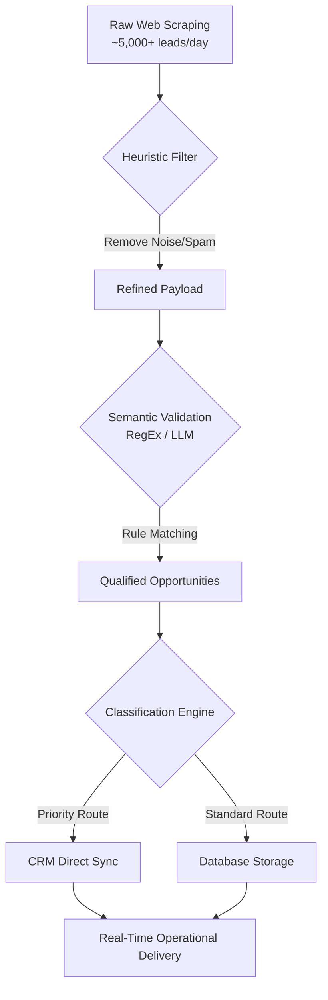

# Bruno Lucusi (@tstryder)
## Business Systems Engineer | Internal Tools • Systems Integration • Data Pipelines • Automation

> *"Most companies don't need more software. They need the software they already use to work together."*

I bridge the gap between business operations and technical infrastructure by diagnosing workflow constraints and engineering internal software solutions. Rather than starting with code, I start with the business process—identifying operational friction and building the exact software required to remove it.

---

### 🏛️ Core Competencies & Matrix (35 / 35 / 30)

* **💼 Business Operations (35%):** Commercial workflow mapping, CRM architecture, sales funnel optimization, lead qualification routing, and operational efficiency.
* **⚙️ Business Systems Engineering (35%):** Relational database modeling, custom REST APIs (FastAPI), secure webhook listeners, and backend middleware services.
* **⚡ Automation Engineering (30%):** Asynchronous Python routines, n8n orchestration, real-time data parsing, and pragmatic LLM integration for automated triage.

---

### 🛠️ Tech Stack & Ecosystem

  

| Layer | Technologies | Primary Function |
| :--- | :--- | :--- |
| **Core Backend** | Python, FastAPI, PostgreSQL | Scalable, typed, and secure backend systems |
| **Automation & Flows** | n8n, REST APIs, Webhooks | Pragmatic workflow orchestration & system sync |
| **Data & Governance** | SQL, Data Pipelines, RegEx, ETL, Redis | Data validation, cleanup, caching, and transaction integrity |
| **AI Workflows** | OpenAI API, Gemini API, Prompt Engineering | Intelligent triage, semantic parsing, and schema validation |
| **Frontend UI** | React, Next.js, Tailwind CSS, Shadcn/ui | Custom administrative panels and internal dashboards |
| **Infrastructure** | Docker, Docker Compose, Linux (Ubuntu), AWS, Caddy | Isolated containerization, cloud deployment, and VPS |

---

### 📂 Featured Systems & Architecture Showcase

#### 🕷️ 1. NexGen Data Intelligence Engine (*NightCrawler Evolution*)
*Autonomous, multi-tenant data intelligence & web scraping architecture built for high-throughput public data extraction and self-healing resilience.*
* **Tech Stack:** Python (`asyncio`, `HTTPX`, `Playwright`, `BeautifulSoup`), FastAPI, PostgreSQL, Redis, RegEx, OpenAI/Gemini APIs, Docker.
* **Fast-Path Profiler & Strategy Fragments:** Adaptive request routing dynamically switching between direct internal API consumption (`InternalAPIFragment`), SEO semantic parsing (`SemanticParserFragment`), and stealth headless browser emulation (`DynamicBrowserFragment`).
* **Two-Layer Filtering Funnel:** High-speed deterministic pre-filtering via RegEx coupled with a structured AI/LLM semantic extraction layer.
* **Hermes Agent Core (Self-Healing Loop):** Autonomous reflection and repair engine featuring schema validation (`HermesReflector`), dynamic parser repair (`HermesHealer`), intelligent network/rate routing (`HermesRouter`), and local RLHF feedback loops.
* **Dual Queue & Resilient Persistence:** Asynchronous buffer queues with Redis/PostgreSQL decoupling high-volume ingestion from database batch persistence.

#### 🔄 2. `crm-sync-engine`
*Middleware engine for real-time transactional data synchronization between CRM platforms (HubSpot, Pipedrive, Kommo) and core databases.*
* **Tech Stack:** Python, FastAPI, PostgreSQL, Webhook Listeners, Redis.
* **Architecture:** Solves data concurrency, prevents network failure data loss, and guarantees webhook event delivery between third-party CRMs and production databases.

#### 📊 3. `internal-ops-dashboard`
*Custom administrative UI built to replace broken, spreadsheet-based operational workflows.*
* **Tech Stack:** React, Next.js, Tailwind CSS, FastAPI, Supabase / PostgreSQL.
* **Architecture:** Centralizes front-line team operations, providing strict data validation forms, approval workflows, and real-time metric rendering.

#### 🧹 4. `data-validation-pipeline`
*High-throughput data extraction, cleansing, and governance engine for complex operational datasets.*
* **Tech Stack:** Python, SQL, Advanced RegEx, Asynchronous ETL.
* **Architecture:** Processes raw, corrupted, or unstructured payloads, applying strict schema rules and normalization before SQL database ingestion.

#### 🤖 5. Global Lead Intelligence & Rerouting Architecture
*Asynchronous processing pipeline handling high-volume daily records with heuristic classification.*

```mermaid
graph TD
    A[Raw Web Scraping <br/> ~5,000+ leads/day] --> B{Heuristic Filter}
    B -->|Remove Noise/Spam| C[Refined Payload]
    C --> D{Semantic Validation <br/> RegEx / LLM}
    D -->|Rule Matching| E[Qualified Opportunities]
    E --> F{Classification Engine}
    F -->|Priority Route| G[CRM Direct Sync]
    F -->|Standard Route| H[Database Storage]
    G --> I[Real-Time Operational Delivery]
    H --> I
```

---

### 🌐 Infrastructure & DevOps

I design environments focused on **high availability**, security, and persistent background execution (24/7 uptime).

* **Cloud Architecture:** Deployment and orchestration of automation environments on **AWS** and **Cloud VPS** (Ubuntu Server via SSH, Caddy Proxy / SSL).
* **Containerization:** Utilizing **Docker & Docker Compose** to ensure environment isolation, portability, and streamlined deployment of scrapers, workers, and APIs.
* **System Administration:** Advanced management of Linux environments, Redis caching/queues, process monitoring, and system optimization.

---

### 📊 GitHub Stats

  
    
  
    
  

---

## 🐍 Contribution Snake

  

---

### 📫 Connect with me

  
  
  

